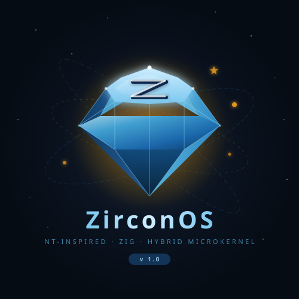
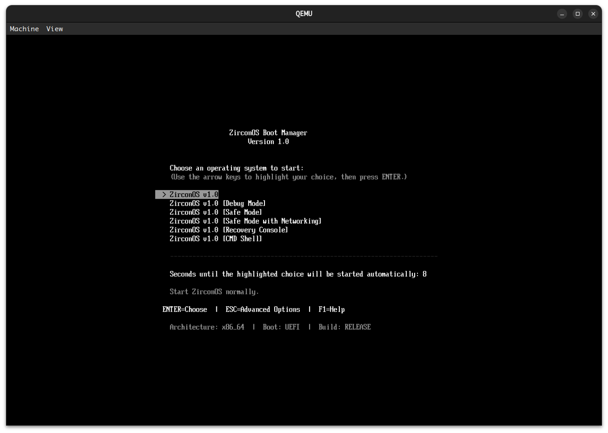
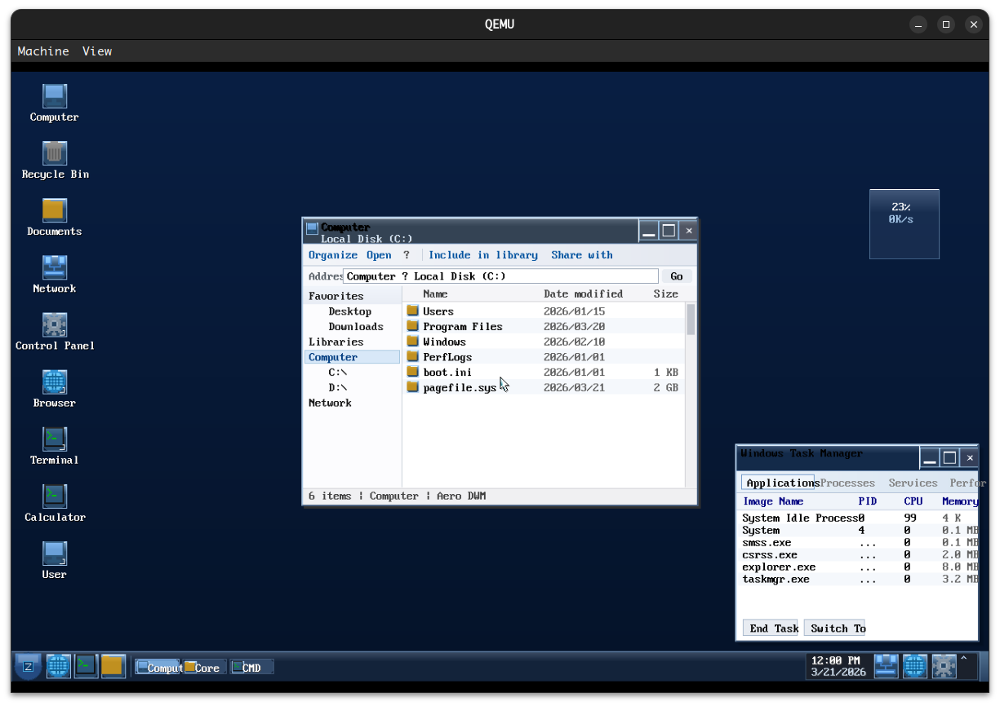
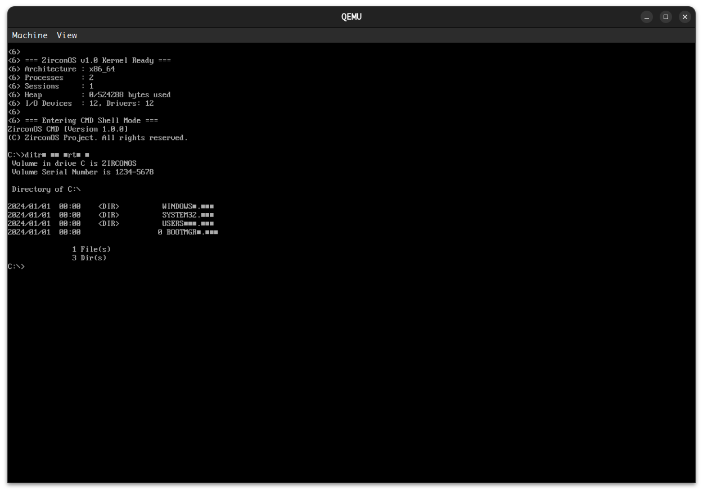

# ZirconOSAero（NT 6.1 目标）

**ZirconOSAero** 是以 **NT 6.1（Windows 7）** ABI/体验为目标的独立 clean-room 内核与用户态栈；Aero 桌面、**仅 ZBM 引导**（BIOS/MBR 与 UEFI），**不包含 GRUB**。**本仓库实现与文档均为独立演进，不复制 Windows/ReactOS 源码**。

**独立项目声明**：本仓库并非 Microsoft 或 Windows 的产品，未获其赞助或背书。「Windows」「Windows 7」等商标归 Microsoft Corporation 及其关联公司所有，本文档中的表述仅用于描述外观兼容或技术类比。实现为原创或与开源许可明确的第三方组件（见 [THIRD_PARTY.md](THIRD_PARTY.md)）。

<p align="center">
  
</p>

## Screenshots

<p align="center">
  
</p>
<p align="center"><em>ZirconOSAero Boot Manager (ZBM) — Windows 7–style text menu</em></p>

<p align="center">
  
</p>
<p align="center"><em>Shell — Windows 7 Aero（NT 6.1）唯一内置桌面</em></p>

<p align="center">
  
</p>
<p align="center"><em>CMD shell</em></p>

**中文说明**：[README_cn.md](README_cn.md)

[](https://github.com/MobtgZhang/ZirconOSAero/actions/workflows/ci.yml)

**CI 与本地复现**：`zig build test`（堆、池、buddy、SSDT、对象句柄表、安全 DAC 等主机测试）；`zig build install -Doptimize=ReleaseSafe -Darch=x86_64`；无头烟测 `bash scripts/ci-qemu-smoke.sh`（构建 ZBM MBR 盘、校验内核 ELF 内嵌横幅，并可选串口增强断言）。**最小可验证测试索引**：[docs/cn/MVT_NT61.md](docs/cn/MVT_NT61.md)。详见 [.github/workflows/ci.yml](.github/workflows/ci.yml) 与 [docs/REPRODUCE_BUILD.md](docs/REPRODUCE_BUILD.md)（Zig **0.15.2**、Release 校验和说明）。

## Design

- **NT-style hybrid microkernel**: scheduling, virtual memory, IPC, interrupts, and syscalls in the kernel
- **User-mode system services**: Object Manager, Process Manager, I/O Manager, Security, etc.
- **Win32 compatibility layer**: ntdll, kernel32, kernelbase, and the console subsystem
- **Win32 subsystem server**: csrss-style management, window stations, and desktops
- **Win32 execution engine**: PE loading, DLL binding, process creation, API dispatch
- **Graphics subsystem**: user32 (windows/messages) and gdi32 (drawing/fonts/bitmaps)
- **WOW64**: PE32 loading, 32→64 syscall thunking, 32-bit PEB/TEB
- **Dual shell**: CMD and **ZirconShell** (PowerShell-style cmdlet subset, not compatible with Microsoft PowerShell)
- **Dual filesystem**: FAT32 (system volume) and NTFS (data volume)
- **Multi-architecture**: x86_64 (primary), aarch64, loongarch64, riscv64, mips64el

**开发流程（必读）**：[docs/cn/PROCESS_NT61.md](docs/cn/PROCESS_NT61.md)

**契约与完成度（必读）**：[docs/cn/NT61_CONTRACT_MATRIX.md](docs/cn/NT61_CONTRACT_MATRIX.md)（与下方矩阵 **Status** 列交叉引用；**Partial / Stub** 表示非 Done）。**MVT**：[docs/cn/MVT_NT61.md](docs/cn/MVT_NT61.md)。

**实现状态标签**：`Stub`（骨架）· `Partial`（部分语义）· `Done`（与公开文档一致）· `Verified`（含自动化回归）。API 覆盖骨架见 [docs/cn/API_COMPAT_MATRIX.md](docs/cn/API_COMPAT_MATRIX.md)。

Documentation: [`docs/README.md`](docs/README.md) · [`docs/en/Architecture.md`](docs/en/Architecture.md) · [`docs/en/Kernel.md`](docs/en/Kernel.md) · [`docs/cn/TIER2_ARCHITECTURES.md`](docs/cn/TIER2_ARCHITECTURES.md) · [`docs/en/Boot.md`](docs/en/Boot.md) · [`docs/en/Servers.md`](docs/en/Servers.md) · [`docs/en/Subsystems.md`](docs/en/Subsystems.md) · [`docs/en/BuildSystem.md`](docs/en/BuildSystem.md) · [`docs/en/Roadmap.md`](docs/en/Roadmap.md)

## Repository layout

```
ZirconOSAero/
├── build.zig              # Zig build
├── build.zig.zon          # Zig dependencies
├── run.sh                 # Build and run helper
├── Makefile               # Make entry point
├── assets/                # Logo and screenshots
├── scripts/               # Build helpers (see scripts/README.md)
├── gnu-efi/               # LoongArch GNU-EFI output (gitignored; make fetch-gnu-efi)
├── boot/
│   ├── uefi/main.zig      # UEFI ZBM (x86_64 / aarch64; LoongArch 见 main_loongarch64.zig)
│   └── zbm/               # ZBM：BIOS/MBR、BCD、菜单（Windows 7 风格）
├── link/                  # Per-architecture linker scripts
│   └── x86_64.ld / aarch64.ld / loongarch64.ld / riscv64.ld / mips64el.ld
├── src/                   # Kernel sources
│   ├── main.zig           # Kernel entry (Phase 0–11 boot path)
│   ├── config/            # Config parser + embedded defaults (*.conf, defaults.zig)
│   ├── arch/              # Architecture code
│   │   ├── x86_64/        #   Multiboot2, paging, IDT, ISR, syscall
│   │   ├── aarch64/       #   AArch64 boot and paging
│   │   └── (loongarch64, riscv64, mips64el)
│   ├── hal/               # Hardware abstraction
│   │   ├── x86_64/        #   VGA, PIC, PIT, port I/O, serial, GDT, framebuffer
│   │   └── aarch64/       #   GIC, timer, PL011 UART
│   ├── drivers/           # Device drivers
│   │   └── video/         #   VGA, HDMI, framebuffer, display manager
│   ├── ke/                # Kernel Executive — scheduling, timer, interrupts, sync
│   ├── mm/                # Memory manager — physical frames, VM, heap
│   ├── ob/                # Object Manager — objects, handle table, namespace
│   ├── ps/                # Process subsystem — processes and threads
│   ├── se/                # Security — token, SID, access checks
│   ├── io/                # I/O Manager — devices, drivers, IRPs
│   ├── lpc/               # LPC — IPC ports and messages
│   ├── rtl/               # Runtime — kernel logging
│   ├── fs/                # File systems — VFS, FAT32, NTFS
│   ├── loader/            # Loader — PE32/PE32+/ELF
│   ├── libs/              # User-mode API libraries
│   │   ├── ntdll.zig      #   Native API (Nt*/Rtl*/Dbg*)
│   │   └── kernel32.zig   #   Win32 base API
│   ├── servers/           # System services
│   │   ├── server.zig     #   Process Server (PID 1)
│   │   └── smss.zig       #   Session Manager (SMSS)
│   └── subsystems/        # Subsystems
│       └── win32/         #   Win32 subsystem
│           ├── subsystem.zig  # csrss server
│           ├── exec.zig       # Win32 execution engine
│           ├── user32.zig     # Windowing API
│           ├── gdi32.zig      # GDI API
│           ├── console.zig    # Console runtime
│           ├── cmd.zig        # CMD
│           ├── powershell.zig # PowerShell-style shell
│           └── wow64.zig      # WOW64 layer
├── src/desktop/           # Desktop theme Zig projects; each has resources/
├── src/fonts/             # Shared open fonts (make fonts / scripts/fonts/fetch-fonts.sh)
└── docs/                  # Design docs (en/ and cn/)
```

## Desktop（Aero）

本仓库仅内置 **Windows 7 Aero** 壳：Zig 与静态资源在 `src/desktop/aero/`（含 `resources/`）。

字体：`make fonts` 或 `scripts/fonts/fetch-fonts.sh` 填充 `src/fonts/`。

LoongArch UEFI 链接 GNU-EFI：`make fetch-gnu-efi`（输出在 `gnu-efi/`；见 `scripts/README.md`）。

`src/config/desktop.conf`（编译期嵌入）中 `[desktop] theme` 仅 **`aero`** 或 **`none`**（无图形壳）。

```ini
[desktop]
theme = aero
color_scheme = zircon_blue
```

## Dependencies

Ubuntu/Debian:

```bash
sudo apt update
sudo apt install -y xorriso dosfstools mtools \
    qemu-system-x86 qemu-system-arm ovmf
```

Install Zig from [ziglang.org](https://ziglang.org/download/) and add it to `PATH`.

## Build and run

```bash
# run.sh (recommended)
./run.sh build              # Kernel (Debug)
./run.sh build-release      # Kernel (Release)
./run.sh iso                # UEFI ISO（ZBM，无 GRUB；x86_64）
./run.sh run                # 按 build.conf 运行 QEMU（默认 UEFI+ZBM）
./run.sh run-debug          # ZBM MBR 磁盘 + GDB
./run.sh run-release        # Release 内核运行
./run.sh run-uefi           # 显式 UEFI+ZBM（x86_64）
./run.sh run-uefi-aarch64   # UEFI (aarch64)
./run.sh run-aarch64        # AArch64 bare metal
./run.sh clean              # Clean
./run.sh help               # Help

# Make shortcuts
make run
make run-debug
make clean
make help

# Zig directly
zig build -Darch=x86_64 -Ddebug=true -Denable_idt=true
```

## Completion disclaimer（完成度说明）

本仓库是面向 **NT 6.1 公开 ABI/文档** 的 **clean-room** 实验性实现：实现与文档均为独立撰写，**不**使用、不翻译、不对照复制 Windows 内核源码或 ReactOS/Wine 等第三方实现代码；行为以 [Microsoft Learn](https://learn.microsoft.com/)、WDK 公开说明及 CPU/固件规范为准。

特性矩阵中的 **Done** 仅表示：在 **QEMU/CI 烟测** 路径上该模块有 **可运行的主路径演示**，并与 [docs/cn/NT61_CONTRACT_MATRIX.md](docs/cn/NT61_CONTRACT_MATRIX.md) 中的契约描述一致。**Done 不表示**与商业版 Windows 7 内核在完整性、边界行为、性能或安全属性上已等价。许多组件仍为 **Partial / Stub**（子集实现或占位）；历史上若出现「全盘 Done」类表述，应视为过时——**以契约矩阵 + 自动化测试 + 源码注释为准**。完整 NT 6.1 级内核是多年工程；本项目的现实定位是 **可验证的研究与渐进兼容**，而非「已复刻完成」的产品声明。

## Phase 0–11 feature matrix（继承上游能力）

| Area | Status | Notes |
|------|--------|--------|
| ZBM boot | Done | BIOS/MBR + UEFI；Windows 7 风格文本菜单 |
| UEFI boot | Done | UEFI app, Debug/Release, Phase 0–11 banner |
| VGA | Done | Text console |
| Serial | Done | COM1 |
| Frame allocator | Partial | 位图 + mmap 过滤；连续页伙伴见 `phys_buddy.zig`（[NT61_CONTRACT_MATRIX §0](docs/cn/NT61_CONTRACT_MATRIX.md)） |
| Paging | Partial | 四级表、恒等映射；每进程 CR3/SMEP 见契约矩阵与 `mitigations.zig` |
| Kernel heap | Partial | Bump + 空闲链表回收 + `mm/pool` 档位；Paged 语义与完整池化见契约矩阵 |
| Section objects | Partial | 匿名节 + `ntdll` / `section.zig`；x64 `syscall` 分发 `NtCreateSection`/`NtMapViewOfSection`/`NtUnmapViewOfSection`（[MM_Section_Roadmap.md](docs/cn/MM_Section_Roadmap.md)） |
| IPC (LPC) | Partial | Queues, ports；连接/通信端口分离雏形、`section_view_handle` 占位（[Win32kArchitectureNotes.md](docs/cn/Win32kArchitectureNotes.md)） |
| Syscall | Partial | `int 0x80` + `syscall`/`sysret`；**NT 6.1 x64 SSDT 子集**；`NtQuerySystemInformation` 等对输出缓冲 `probe`（[SyscallABI.md](docs/cn/SyscallABI.md), [ssdt_nt61.zig](src/arch/x86_64/ssdt_nt61.zig)） |
| IDT/ISR | Done | 256 vectors |
| Scheduler | Partial | 多优先级就绪队列（idle/normal 档）；完整 32 级与饥饿策略见契约矩阵 |
| Timer | Partial | PIC + PIT ~100Hz；高精度见 [TimerPrecisionRoadmap.md](docs/cn/TimerPrecisionRoadmap.md) |
| Sync | Done | Event, mutex, semaphore, spinlock |
| Object Manager | Partial | 类型、句柄表、命名空间子集；主机测试 [zircon_host_ob_test.zig](src/zircon_host_ob_test.zig) |
| Process Manager | Partial | 进程/线程、Process Server；隔离与 CR3 切换见契约矩阵 §0 |
| Session Manager | Done | SMSS, sessions, subsystem registration |
| Security | Done | Token, SID, access checks |
| I/O Manager | Partial | 设备、驱动、`IoCompleteRequest` 与 VFS IRP 桥接；PnP/PCI 见 `acpi_pci_early.zig` |
| VFS | Done | Mount points |
| FAT32 | Done | Files/dirs on `C:\` |
| NTFS | Done | MFT, files/dirs on `D:\` |
| PE32+ loader | Done | Headers, DLLs, imports, relocs, PEB/TEB |
| PE32 loader | Partial | 32-bit PE + WOW64；与官方 SysWOW64/SSDT 不对齐 |
| ELF loader | Done | ELF64 headers, segments, shared objects |
| ntdll | Partial | Native API 子集；服务号见 SSDT 路线图 |
| kernel32 | Partial | Win32 base API 子集 |
| user32 | Partial | 窗口/消息/类；NC HitTest、DWM 广播子集；完整 NC 序列见契约矩阵 |
| gdi32 | Partial | DC/原语/字体/位图子集；分阶段见 `gdi32.zig` 头注释与契约矩阵 |
| Console | Done | Console runtime |
| CMD | Done | dir, cd, set, ver, systeminfo, tasklist, … |
| ZirconShell (PowerShell-style) | Partial | cmdlet 子集；非 Microsoft PowerShell / CLR |
| csrss | Partial | Win32 server, stations, desktops, GUI dispatch |
| Exec engine | Partial | PE load, DLL bind, lifecycle |
| WOW64 | Partial | PE32, thunk；32→64 服务号须对齐 `ssdt_nt61.zig`（与旧 `SYS_*` 已分离）— 见 `wow64.zig` |
| Registry runtime | Partial | 内存树 + `Mouse`/`Desktop`/`HKLM\...\Windows\DWM`/`Memory Management` 等键；RegF/hive 持久化 Planned |
| Aero / DWM (kernel shell) | Partial | 脏矩形/分层路径与 `compositor_config_epoch` 握手 trace；CPU 合成与 Win7 WDDM 差异见 [DesktopManagerSpec.md](docs/cn/DesktopManagerSpec.md) |
| 多架构 Win32 栈 | Partial | **x86_64** 为主验证路径；riscv64/LoongArch/MIPS 引导与桌面见各 `arch` 文档与 CI 说明 |

## Milestones

- **Phase 0** — Toolchain and QEMU debugging  
- **Phase 1** — Boot and early kernel (GDT/Multiboot2/frame/heap)  
- **Phase 2** — Traps, timer, scheduler  
- **Phase 3** — VM and user mode  
- **Phase 4** — Objects, handles, process core  
- **Phase 5** — IPC and system services (SMSS/LPC)  
- **Phase 6** — I/O, filesystems (FAT32/NTFS), drivers  
- **Phase 7** — Loaders (PE32/PE32+/ELF, DLLs, imports, relocs)  
- **Phase 8** — Native userland (ntdll/kernel32, CMD, PowerShell)  
- **Phase 9** — Win32 subsystem (csrss, exec engine, PE/DLL)  
- **Phase 10** — Graphics (user32, gdi32, message queue, GUI dispatch)  
- **Phase 11** — WOW64 (PE32, thunking, 32-bit PEB/TEB)  
