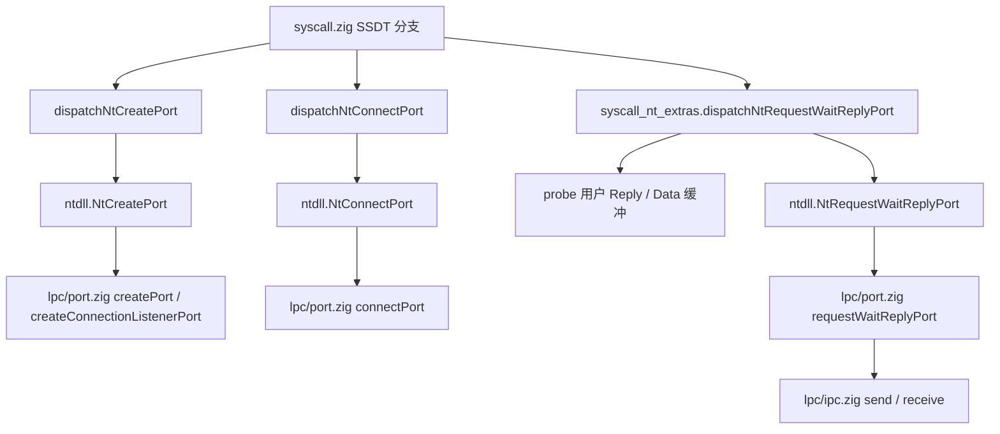

# LPC：`Nt*Port` 内核调用链与 `owner_pid` 数据流

与 [LPC_NT61_HANDSHAKE.md](LPC_NT61_HANDSHAKE.md) 配套；描述 **clean-room** 子集实现，不对照 Windows/ReactOS 源码。

## 调用链（x86_64）

## `owner_pid` 与队列索引

| 步骤 | 数据 |
|------|------|
| `NtCreatePort` | `port.createPort(pid, name)` → `Port.owner_pid = pid`（服务端监听端口）。 |
| `NtConnectPort` | `connectPort(client_pid, name)` → 新客户端端口 `owner_pid = client_pid`，`connected_port` 指向服务端端口 id。 |
| `NtRequestWaitReplyPort` | `requestWaitReplyPort(client_pid, port_id, …)` 校验 `findPortById(port_id).owner_pid == client_pid`；`ipc.send(client_pid, server_port.owner_pid, …)` 将消息投递到 **服务端 PID** 对应队列；应答经 `ipc.receive(client_pid)` 或 csrss 同步路径返回。 |

**`ipc` 队列键**：`receiver_pid` 经 `pid - 1` 映射到 `message_queues` 下标（`MAX_QUEUES = 64`）；`pid == 0` 或 `pid > MAX_QUEUES` 时发送失败。

## 用户缓冲与安全

- **syscall 层**：`dispatchNtRequestWaitReplyPort` 已对 **Reply**（`ipc.Message`）与可选 **Data**（`MSG_DATA_SIZE` 字节）做 `probe`（见 `syscall_nt_extras.zig`）。
- **内核消息体**：固定 `ipc.MSG_DATA_SIZE`（64）字节；大于此载荷须走 **`section_view_handle` / 大消息** 路线图（见 [LPC_NT61_HANDSHAKE.md](LPC_NT61_HANDSHAKE.md) 与 [MM_Section_Roadmap.md](MM_Section_Roadmap.md)）。

## 服务端唤醒

- 当前服务端同步路径 `replyWaitReceivePort` 使用 **自旋 + `ipc.receive`**；完整 NT 语义下应在 `ipc.send` 后唤醒阻塞的服务端线程。与调度器的显式 `unblockThread` 接线为 **路线图项**（与 [SCHEDULER_API.md](SCHEDULER_API.md) 协同）。
