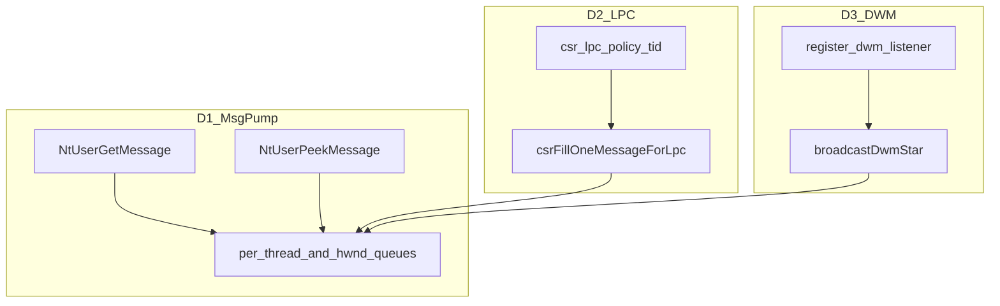

# 阶段 D：Win32 消息泵与 DWM 消息对接 — 详尽待办（Clean-room）

本文档为 **阶段 D** 的验收分解清单，与 [NT61_CONTRACT_MATRIX.md](NT61_CONTRACT_MATRIX.md) §4–§5、[DesktopManagerSpec.md](DesktopManagerSpec.md)、[DWM_NOTIFY_MODEL_NT61.md](DWM_NOTIFY_MODEL_NT61.md)、[LPC_NT61_HANDSHAKE.md](LPC_NT61_HANDSHAKE.md) 交叉引用。

**命名说明**：本「阶段 D」指 **消息泵 + DWM 通知/LPC 对接**；≠ [NT61_PLAN_REMAINING.md](NT61_PLAN_REMAINING.md) 中「Phase D — 合成器」。合成器纵深见该文 D1–D5 与 [AeroDesktopRuntime.md](AeroDesktopRuntime.md)。**与 Roadmap Phase 0–11 及全文 Phase 字母编号对照**：[README.md](README.md) 第二节。

**知识来源**：仅 Microsoft Learn / WDK 公开描述与 Intel SDM 等白名单；syscall 号用社区公开索引并在源码注释标明；**不**引用任何内部草稿路径作为对外依据。

**合规**：独立实现，禁止复制 Windows/ReactOS/Wine 源码；API 名与公开常量值属 ABI 范畴。

---

## D0 — 完成定义与现状审计

| ID | 任务 | 验收 |
|----|------|------|
| D0.1 | 冻结阶段 D「做 / 不做」：消息队列一致性、`WM_DWM*` 投递与监听、`GetMessage`/`PeekMessage` 与 Learn 的 **已知差距表** 保持可检索（矩阵 §5 + 本文） | 契约矩阵与 [msg_pm_semantics.zig](../../src/subsystems/win32/msg_pm_semantics.zig) 注释同步 |
| D0.2 | 明确 **不做**：完整挂钩链、DDE、输入法管线、与商业 `user32` 逐位等价 | 矩阵 §5.1 非目标段已覆盖则仅交叉引用 |
| D0.3 | 更新 [MVT_NT61.md](MVT_NT61.md)：阶段 D 每增一项可重复测试须登记命令与模块 | PR 门禁 |
| D0.4 | **完成定义（冻结）**：阶段 D 「Done」= §D1–D3 主路径在 `zig build test` 相关主机步 + 契约矩阵 §4–§5 三态一致；**不**声称与商业 `user32` 逐位等价 | 本文 + 矩阵 |
| D0.5 | **常量单源**：`nt61_aero_defaults.zig` / `zircon_aero_defaults.zig` / `dwm_nt61_api_contract.zig` 冲突时以矩阵 [NT61_CONTRACT_MATRIX.md](NT61_CONTRACT_MATRIX.md) §4 脚注为准 | `comptime` 测与 **dwm_messages_nt61_host** |

---

## D1 — 消息泵内核语义（`user32` / syscall）

| ID | 任务 | 主要路径 |
|----|------|----------|
| D1.1 | **`NtUserGetMessage`**：多线程下 `blockThread` + `wakeOneMsgWaiter` 与 `PostMessage`/`PostThreadMessage` 唤醒一致性审计；单线程 **`STATUS_PENDING`** 策略是否需改为「可配置忙等上限」或文档化 | [user32.zig](../../src/subsystems/win32/user32.zig) `getMessageAWithYield`、`ntUserGetMessageSyscall`；[syscall.zig](../../src/arch/x86_64/syscall.zig) |
| D1.2 | **`NtUserPeekMessage` 与 Learn**：**进展** — 空队列 `STATUS_NO_MORE_ENTRIES` + 清零 `MSG*`（用户态映射 FALSE；非 `STATUS_PENDING`） | `ntUserPeekMessageSyscall`、`PeekMessageA` |
| D1.3 | **`PM_REMOVE` / `PM_NOYIELD`**：保证 `PeekMessage` 路径 **不** 与 `GetMessage` 错误共享 yield/block；`allowSchedulerYieldForPeekFlags` 与实现事实一致（注释 + 主机测） | [msg_pm_semantics.zig](../../src/subsystems/win32/msg_pm_semantics.zig) |
| D1.4 | **min/max 过滤**：`getMessageFiltered` 轮转非匹配消息与 Learn「丢弃/重排」差距；补主机用例或文档边界 | `Window.getMessageFiltered` / `peekMessageFiltered` |
| D1.5 | **`WM_QUIT`**：投递、跨线程可见性、`GetMessage` 返回 `FALSE` 映射（若走 ntdll 包装） | `user32` 队列与 syscall 返回约定 |
| D1.6 | **`DispatchMessage` / `NtUserDispatchMessage`**：**进展** — `WindowClass.wndproc_id` + `registerKernelWndProc` 内核表；用户 VA `WndProc` 仍为路线图 | [NT61_CONTRACT_MATRIX.md](NT61_CONTRACT_MATRIX.md) §5、`user32.zig` |
| D1.7 | **输入路由**：`input_hub` → 窗口命中 → `PostMessage` 顺序与前台线程；与 [PointerPolicy_NT61.md](PointerPolicy_NT61.md) 一致 | `input_hub.zig`、`user32` |
| D1.8 | **`PostQuitMessage`**：**进展** — 仅向调用线程 `PostThreadMessage(WM_QUIT)`，对齐 Learn（不再向进程内每窗各投一条） | `user32.zig` |

---

## D2 — csrss / LPC 与消息泵真源

| ID | 任务 | 主要路径 |
|----|------|----------|
| D2.1 | **`get_message`**：`csrFillOneMessageForLpc` 与 `peekMessageAForThread` 的 **tid** 与 `CreateWindowEx` 的 `thread_id` 同源；禁止 `tid==0`（`resolveGetMessageClientTid`） | [user32.zig](../../src/subsystems/win32/user32.zig)、[csr_lpc_policy.zig](../../src/subsystems/win32/csr_lpc_policy.zig)、[subsystem.zig](../../src/subsystems/win32/subsystem.zig) |
| D2.2 | **`post_message` / 应答负载**：与 `packMsgForLpc`、44 字节 `MSG` 布局一致；版本魔数与 [LPC_NT61_HANDSHAKE.md](LPC_NT61_HANDSHAKE.md) 同步 | `ipc`、`subsystem` |
| D2.3 | **GUI 端口 ACL**：`seAccessActiveDesktopForWin32k` 与活动桌面一致（占位升级为真实 token 检查） | [se/token.zig](../../src/se/token.zig)、矩阵 §4.1 |
| D2.4 | **`register_dwm_listener`（v1）**：载荷 `0x014D5744` + tid；内核表与 `csr_dwm_listeners` 双端一致 | [csr_dwm_listeners.zig](../../src/subsystems/win32/csr_dwm_listeners.zig)、`LPC_NT61_HANDSHAKE` |

---

## D3 — DWM 消息与合成触发对接

| ID | 任务 | 主要路径 |
|----|------|----------|
| D3.1 | **`WM_DWMCOMPOSITIONCHANGED` 等**：`user32.broadcastDwm*` 与 `dwm.zig` / `syncPolicyFromRegistry` 触发表一致 | [DWM_NOTIFY_MODEL_NT61.md](DWM_NOTIFY_MODEL_NT61.md) |
| D3.2 | **启动豁免**：无 HWND 时不刷 `WM_DWM*`（噪声控制）；有 HWND 后注册表差异补发 | `dwm_config_registry_sync.zig`、`dwm_nt61_integration_host` |
| D3.3 | **缩略图 / Live Preview**：`WM_DWMSENDICONICTHUMBNAIL`、`WM_DWMSENDICONICLIVEPREVIEWBITMAP` 的 `lParam` 打包与节流 `thumb_refresh_min_ticks` | [dwm_nt61_api_contract.zig](../../src/config/dwm_nt61_api_contract.zig)、`display`/`user32` |
| D3.4 | **`DwmRegisterThumbnail` 像素路径**：`DWM_TNP_*` 子集与 `blitRegisteredDwmThumbnailsToFramebuffer` 行为在矩阵 §4.1 已 Partial 则仅补测试 | `dwm_compositor.zig`、`display.zig` |
| D3.5 | **监听线程队列**：监听线程与普通 GUI 线程共用消息模型时的优先级（DWM 通知是否插队）— 文档化策略 | 本文 + `DesktopManagerSpec` |

---

## D4 — 桌面循环与 idle 策略（与合成协同）

| ID | 任务 | 主要路径 |
|----|------|----------|
| D4.1 | 降低对 **`desktop_idle_spin`** 的依赖：有消息或合成脏区时唤醒主循环。**进展**：`runDesktopMainLoop` 文档注释 + `msgPumpThreadsBlockedApprox()` 时追加 `input_hub` 轮询；`idle_streak` × `display_flip_journal.extraInputPollBudget` 尾部 poll | [NT61_PLAN_REMAINING.md](NT61_PLAN_REMAINING.md) D5、`display.zig`、`main.zig` |
| D4.2 | IRQ / 定时器路径与 **Present 提示** 绑定，避免只改 spin 或只改合成一半 | `AeroDesktopRuntime.md`、CI 烟测 |
| D4.3 | **`display_flip_journal`** 与 `notifyFramePresented` / idle 协同：每帧 flush 计数与 `input_hub` 尾部 poll 预算同源（见 `display_flip_journal.zig` 注释） | `display_flip_journal.zig`、`display.zig` |

---

## D5 — 测试与矩阵

| ID | 任务 | 验收 |
|----|------|------|
| D5.1 | 扩展现有主机测：**msg_pm_semantics**、**csr_lpc_policy**、**dwm_messages_nt61**、**dwm_nt61_integration** — 每增一语义必增一断言 | `zig build test` |
| D5.2 | 可选 QEMU：`scripts/qemu_desktop_perf_baseline.sh` 第 5 步 — 串口 `grep -E 'WM_DWM|get_message|present|flip_journal'` | 软门槛，非强 CI |
| D5.3 | 更新 [NT61_CONTRACT_MATRIX.md](NT61_CONTRACT_MATRIX.md) §4–§5 行：Partial/Done 与实现一致 | PR |
| D5.4 | **性能软门槛**：idle 下 CPU 占用或每帧 `memcpy` 上限 — 文档化于 `DesktopManagerSpec` / 本文 D4；超标不 fail CI | 文档 |

---

## 建议实施顺序

1. D0 + D1.1–D1.3（消息泵正确性与文档）  
2. D2（LPC/csrss 真源）  
3. D3（DWM 广播与监听）  
4. D4 + D5（桌面循环与测试矩阵）

---

## 维护

更新本文时同步 [NT61_KERNEL_TODO.md](NT61_KERNEL_TODO.md) 阶段 D 索引行与根 [README_cn.md](../../README_cn.md) 若涉及「消息泵 / DWM」对外表述。

**收尾边界（A–F 计划）**：D1–D5 未标 **Done** 的项以本文表格 + 契约矩阵 §4–§5 为**冻结验收**；增量实现须补对应主机测或矩阵一行。**WOW64** 与 x86 `NtConnectPort` / `NtRequestWaitReplyPort` 演示路径见 [PHASE_G_WOW64.md](PHASE_G_WOW64.md)。
