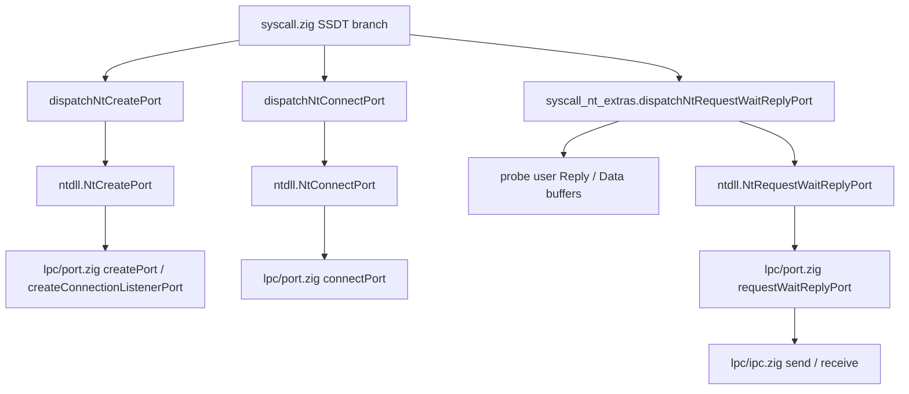

# LPC: `Nt*Port` Kernel Call Chain and `owner_pid` Data Flow

> Companion to [LPC_NT61_HANDSHAKE.md](LPC_NT61_HANDSHAKE.md). Describes **clean-room** subset implementation; does not reference Windows/ReactOS source.

## Call Chain (x86_64)

## `owner_pid` and Queue Index

| Step | Data |
|------|------|
| `NtCreatePort` | `port.createPort(pid, name)` → `Port.owner_pid = pid` (server listen port). |
| `NtConnectPort` | `connectPort(client_pid, name)` → new client port `owner_pid = client_pid`; `connected_port` points to server port id. |
| `NtRequestWaitReplyPort` | `requestWaitReplyPort(client_pid, port_id, …)` validates `findPortById(port_id).owner_pid == client_pid`; `ipc.send(client_pid, server_port.owner_pid, …)` delivers message to **server PID** queue; reply via `ipc.receive(client_pid)` or csrss sync path. |

**`ipc` queue key**: `receiver_pid` maps to `message_queues` subscript via `pid - 1` (`MAX_QUEUES = 64`); `pid == 0` or `pid > MAX_QUEUES` causes send failure.

## User Buffer and Security

- **Syscall layer**: `dispatchNtRequestWaitReplyPort` probes **Reply** (`ipc.Message`) and optional **Data** (`MSG_DATA_SIZE` bytes) (see `syscall_nt_extras.zig`).
- **Kernel message body**: fixed `ipc.MSG_DATA_SIZE` (64) bytes; payloads larger than this must use **`section_view_handle` / large message** roadmap (see [LPC_NT61_HANDSHAKE.md](LPC_NT61_HANDSHAKE.md) and [MM_Section_Roadmap.md](../cn/MM_Section_Roadmap.md)).

## Server Wake-up

- Current server sync path `replyWaitReceivePort` uses **spin + `ipc.receive`**; full NT semantics would wake blocked server thread after `ipc.send`. Wiring to scheduler's explicit `unblockThread` is a **roadmap item** (coordinated with [SCHEDULER_API.md](../cn/SCHEDULER_API.md)).
