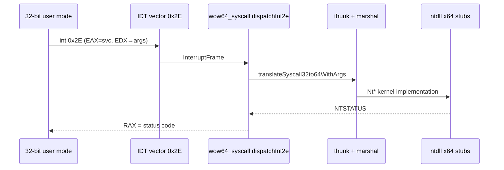

# Phase G: WOW64 / SysWOW64 Behavioral Subset (ZirconOSAero)

> **Naming note**: This "Phase G" is **WOW64 testable subset** (x86/x64 service numbers, thunk, pointer/handle rules); **≠** [Roadmap.md](Roadmap.md) "Phase 11 — WOW64 + audio" full text. **Phase naming cross-reference**: [cn/README.md](../cn/README.md) §Phase table.

## Knowledge Sources and Boundaries

- Behavioral descriptions: [Microsoft Learn](https://learn.microsoft.com/) / WDK public docs and this repo's `docs/cn` contracts.
- **x86 / x64 service number correspondence**: based on public datasets (e.g. j00ru [windows-syscalls](https://github.com/j00ru/windows-syscalls) `nt-per-system.json`); code annotated with URL/dataset name, **no** closed-source table copied.
- **NOT a goal**: bit-behavioral equivalence with commercial Windows 7 SysWOW64; complete parameter marshaling; commercial ntdll binary compatibility; full filesystem/registry redirection.

## Implementation Anchors (Code)

| Component | Path | Description |
|-----------|------|-------------|
| x86 Win7 SP1 subset | [`ssdt_x86_win7_sp1.zig`](../../src/subsystems/win32/wow64/ssdt_x86_win7_sp1.zig) | Native 32-bit service numbers; `wow64SyscallStubReturnsSuccess` |
| x64 SSDT subset | [`ssdt_nt61.zig`](../../src/arch/x86_64/ssdt_nt61.zig) | Kernel/ntdll shared index true source |
| x86→x64 same-name mapping | [`x64_semantic_alias.zig`](../../src/subsystems/win32/wow64/x64_semantic_alias.zig) | `x64SsdtIndexForWin7Sp1X86` (**does not** claim complete marshaling); `NtTerminateThread` → `ssdt_nt61.NtTerminateThread` (**0x55**, conflict with j00ru x64 public **0x51**: see `ssdt_nt61` comments) |
| Thunk entry | [`thunk.zig`](../../src/subsystems/win32/wow64/thunk.zig) | `translateSyscall32to64` / `translateSyscall32to64WithArgs`, `marshal` dispatch; x86 **win32k** numbers (`≥0x1000`) explicit `STATUS_NOT_IMPLEMENTED` |
| Marshaling subset | [`marshal.zig`](../../src/subsystems/win32/wow64/marshal.zig) | See table below under stdcall; stubs not listed still return `STATUS_SUCCESS` for demo |
| Redirection testable subset | [`redirect.zig`](../../src/subsystems/win32/wow64/redirect.zig) | UTF-16LE `\System32\`→`\SysWOW64\`; narrow paths `\Registry\Machine\SOFTWARE\` insert `Wow6432Node\`; wired in `syscall.zig` / `ntdll` (`NtOpenKey`/`NtCreateKey`) |
| Process demo | [`wow64.zig`](../../src/subsystems/win32/wow64.zig) | `Wow64Process`, `last_x64_ssdt_alias`; PEB32 version field from [`os_version.zig`](../../src/config/os_version.zig) |
| PE32 load policy (shared with E10) | [`pe.zig`](../../src/loader/pe.zig) | Honest boundaries for delay-load / bound: see [PHASE_E_NATIVE_API.md](PHASE_E_NATIVE_API.md) E10 |
| **Kernel `int 0x2E` dispatch** | [`wow64_syscall.zig`](../../src/arch/x86_64/wow64_syscall.zig), [`interrupt_x86.zig`](../../src/ke/interrupt_x86.zig) | See sequence diagram below; 8259 remap: [`pic.zig`](../../src/hal/x86_64/pic.zig) |

## 32-bit User-Mode `int 0x2E` → Kernel (x86_64)

Unlike pure x64 **`syscall`**: in compatibility mode **`int 0x2E`** uses **IDT vector 0x2E**; CPU pushes **IRET-style** return frame; `isr_common` saves all GPRs before `isr_common_handler` → `interrupt_x86.handle`.

- **Register convention (on entry to `dispatchInt2e`)**: **RAX** low 32 bits = x86 **service number** (same namespace as `ssdt_x86_win7_sp1`); **RDX** low 32 bits = user VA pointing to **up to 16×`u32`** argument region (stdcall left-to-right: `args[0]…`, consistent with stdcall (Win32 x86) argument order table below). **RCX/R8/R9/R10** do **not** carry NT x64 syscall formal parameters on this path.
- **Authoritative WOW64 determination**: `Process.is_wow64` **or** `Wow64Process` slot with same PID (`wow64.zig`); scheduler thread `Thread.is_wow64` synchronized with process at `attachWow64IfPresent` / `createThread`.
- **Dispatch**: only `thunk.translateSyscall32to64WithArgs` → `marshal.dispatchWow64Stub` (and stub list strategy); **does not** hard-code SSDT mapping table here.

**IA32_SYSENTER_** (fast syscall): this phase uses **documented + shareable semantics with `int 0x2E`** as anchor; complete **SYSEXIT** return frame and per-CPU MSR setup are follow-up items (avoid mixing with `syscall/sysret` dual paths).

## Dual PEB / TEB Layout and Milestones (G-B2 / F coordination)

- **PEB64 / TEB64**: x64 user process main thread constrained by loader and `kuser_shared` / `teb_nt61_x64` paths; aligned with [PHASE_F_PROCESS_CREATE.md](PHASE_F_PROCESS_CREATE.md) process creation milestone.
- **PEB32 / TEB32**: `types.zig` `extern` subset + comptime offset tests (Learn `PEB`/`TEB` public field semantics); demo VAs `PEB32_DEFAULT_USER_VA` / `TEB32_DEFAULT_USER_VA`.
- **Kernel `Process` mirror**: `ps/process.zig` `peb32_user_va` / `teb32_user_va` and `is_wow64` coordinated by `wow64.zig`; `createWow64Process` on x86_64 **maps one user-writable page each for PEB32/TEB32** and writes `extern` layout. **Section views / `NtAllocateVirtualMemory` full path probe** still Partial: see contract matrix §9.1.

## stdcall (Win32 x86) Argument Order → `marshal` / x64 `ntdll` Stubs

| x86 service (Win7 SP1) | stdcall stack order `args[0]…` | x64 / `ntdll` call |
|------------------------|---------------------------|-----------------|
| `NtClose` | `Handle` | `NtClose(@as(u64, Handle))` |
| `NtWaitForSingleObject` | `Handle`, `Alertable`, `Timeout` | `Timeout==0` → `null`; else user VA must ≤ `WOW64_MAX_ADDR` (`types.zig`), then `NtWaitForSingleObject` |
| `NtTerminateProcess` | `ProcessHandle`, `ExitStatus` | `NtTerminateProcess(handle, @bitCast ExitStatus)` |
| `NtDelayExecution` (x86 **0x62**) | `Alertable`, `*LARGE_INTEGER` | read user `interval`; then `NtDelayExecution` |
| `NtAllocateVirtualMemory` | `Proc`, `**Base`, `ZeroBits`, `**RegionSize`, `AllocType`, `Protect` | 32-bit pointer expand + write back `Base`/`RegionSize` (low 32 bits) |
| `NtFreeVirtualMemory` | `Proc`, `**Base`, `**RegionSize`, `FreeType` | same |
| `NtDuplicateObject` (x86 **0x39**) | seven-arg stdcall | `TargetHandle` is user-side `*HANDLE32` write-back |
| `NtReadFile` / `NtWriteFile` | first seven args include `IoStatusBlock`, `Buffer`, `Length` | kernel temp `IO_STATUS_BLOCK` then **copy back** user IOSB (demo path; full probe and Phase F coordination) |
| `NtProtectVirtualMemory` | `ProcessHandle`, `*Base`, `*RegionSize`, `NewProtect`, `*OldProtect` | 32-bit pointer expand; write back `Base`/`RegionSize`/`OldProtect` low 32 bits |

**Pointer validation**: `userVaFromWow64Ptr32` / `convertPtr32to64` reject or zero-initialize `> WOW64_MAX_ADDR` (`0x7FFF_FFFF`), avoiding treating kernel high addresses as user pointers.

## Verification and Tests

| Gate | Description |
|------|-------------|
| `zig build test` | **wow64_ssdt_x86**, **ssdt_x64_x86_namespace**, **wow64_x64_semantic_alias_host**, **wow64_redirect_host**, **phase4_host_anchors**, **partition_table_host** |
| `translateSyscall32to64` / `WithArgs` | stub hit writes `last_x64_ssdt_alias`; **with-args** path via `marshal` calls `ntdll` (`NtClose`, `NtWaitForSingleObject`, `NtTerminateProcess`, `NtDelayExecution` etc.); no-arg calls return demo success |
| `Process` / PEB32 | [`process.zig`](../../src/ps/process.zig): `is_wow64`, `peb32_user_va`, `teb32_user_va`; [`types.zig`](../../src/subsystems/win32/wow64/types.zig): `PEB32`/`TEB32` `extern` subset layout; demo VAs `PEB32_DEFAULT_USER_VA` / `TEB32_DEFAULT_USER_VA`; `NtQueryInformationProcess`(`ProcessWow64Information`) |
| NTSTATUS | consistent with [`ntdll.zig`](../../src/libs/ntdll.zig) constants; win32k x86 numbers and unimplemented paths `STATUS_NOT_IMPLEMENTED` |

## Maintenance Conventions

- When extending `wow64SyscallStubReturnsSuccess`: **synchronize** `x64_semantic_alias.x64SsdtIndexForWin7Sp1X86` (if `ssdt_nt61` already has same-name constant), **ssdt_x64_x86_namespace** / **wow64_x64_semantic_alias_host** assertions, matrix §9.1.
- win32k folded slots and x86 native win32k numbers are **different namespaces** — see `ssdt_x86_win7_sp1.Win32kNtUserPostMessage_x86_index4111` and `ssdt_nt61.NtUserPostMessage` comments.

---

## WOW64 on LoongArch64 (x86-32 on LA64 Hosts)

This section describes **observable behavior boundaries** for ZirconOSAero running 32-bit x86 subsystems on **LoongArch64**, without copying Windows DDK/SDK declarations. Implementation is original.

### Terminology

- **x86 WOW64**: Running **x86-32** images on LA64 requires **binary translation** (interpreter, DBT, or optional third-party engine like LATX); kernel still accepts only **native LA64** syscalls; translation layer is responsible for converting x86 `int 0x2E` / `sysenter` etc. to calls into this repository's `wow64/thunk.zig` and x86 SSDT subset.
- **LoongArch32**: independent ABI, **must not** reuse x86 thunk tables; requires separate PE/ELF machine types, VA, and user syscall conventions (see `la32_policy.zig` placeholder).

### NTSTATUS Matrix (Current)

| Scenario | Behavior |
|----------|---------|
| Host LA64 native PE (0x6264) | Uses `pe.zig` / process creation existing path |
| x86-32 image execution | Before engine wiring: `STATUS_NOT_IMPLEMENTED` (or process creation rejection) |
| LBT | `lbt_hw.zig` probe is false → ignored; genuine probe must be based only on public manuals |

### Relationship with Microsoft CHPE / ARM64EC

This project **does not** implement or claim CHPE/ARM64EC compatibility.
